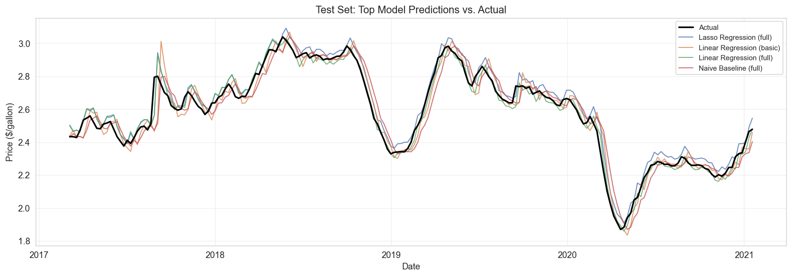

# Hi, I'm Jasper Fan-Chiang 👋

### Applied Data Science | Machine Learning | Data Engineering

M.S. in Applied Data Science at the University of Southern California  
Building data products that turn complex, real-world data into practical insights.

---

## 👨‍💻 About Me

I am an Applied Data Science graduate student at the **University of Southern California**, graduating in **December 2026**. My interests span machine learning, predictive modeling, data engineering, and data visualization.

I enjoy building end-to-end data solutions - from data validation, preprocessing, and feature engineering to model evaluation and interactive applications. My recent work includes large-scale real estate price modeling and weekly gasoline price forecasting.

- 🎓 M.S. in Applied Data Science at USC - GPA: **3.78/4.00**
- 📐 B.A. in Mathematics with a Minor in Data Science from the University of Washington
- 🔍 Interested in **Data Scientist**, **Data Analyst**, and **Machine Learning Engineer** opportunities
- 💼 Open to **2027 internship opportunities**
- 🌱 Currently focused on reproducible ML pipelines, scalable data workflows, and applied predictive modeling

## 🛠️ Technical Skills

### Languages

### Data Science & Machine Learning

### Data, Applications & Workflow

`ETL` · `REST APIs` · `Statistical Analysis` · `Hypothesis Testing` · `Data Visualization`

## 🚀 Featured Projects

### 🏡 [California Residential Price Modeling - IDX Exchange](https://github.com/jasperfc/IDX-Exchange)

- Built a leakage-aware machine learning pipeline for **370K+ California residential property transactions**.
- Engineered temporal, geospatial, property, and school-district features with Pandas and GeoPandas.
- Compared Random Forest, XGBoost, and LightGBM; LightGBM achieved a held-out **R² of approximately 0.906**.
- Developed reusable preprocessing and train/test workflows to support reproducible experimentation.

**Tech:** Python · Pandas · GeoPandas · scikit-learn · XGBoost · LightGBM · Streamlit

### ⛽ [Weekly Gasoline Price Forecasting](https://github.com/jasperfc/Weekly-Gasoline-Price-Forecasting)

- Built an end-to-end pipeline for forecasting weekly U.S. gasoline prices.
- Engineered lag, rolling-window, momentum, and seasonal features for time-series modeling.
- Benchmarked linear, tree-based, and neural-network models using MAE and RMSE.
- Analyzed regional variation, geopolitical price shocks, volatile periods, feature importance, and concept drift.

**Tech:** Python · scikit-learn · XGBoost · PyTorch · pandas · Time Series

## 💼 Professional Experience

### Data Science Intern - IDX Exchange
`Jun 2026 - Aug 2026 | Remote`

- Developed a full machine learning workflow for large-scale California residential property valuation.
- Created geospatial and temporal features, including spatial joins with school-district boundaries.
- Built reproducible preprocessing and evaluation pipelines designed to prevent target leakage.

### Risk and Financial Management Consultant Intern - KPMG
`Sep 2022 - Dec 2022 | Taipei, Taiwan`

- Contributed to an Early Warning System for consumer and corporate risk monitoring at Mega Bank.
- Automated large structured-data transformations through an Excel-to-JSON pipeline.
- Produced software design documents and system flowcharts connecting stakeholder needs with engineering implementation.

### System Testing and UI Design Intern - GEMINI Data
`Jul 2020 - Sep 2020 | Taipei, Taiwan`

- Processed and stress-tested **10M+ records** to evaluate system scalability and performance.
- Applied graph-based clustering to identify relationships in large datasets.
- Developed the team's top-rated user-interface concept.

## 🎓 Education

### University of Southern California
**Master of Science in Applied Data Science**  
Expected December 2026 · GPA: **3.78/4.00**

### University of Washington
**Bachelor of Arts in Mathematics · Minor in Data Science**  
September 2018 - June 2022 · GPA: **3.49/4.00**

## ⭐ Core Competencies

- 🤖 Machine Learning & Predictive Modeling
- ⚙️ Feature Engineering & Model Evaluation
- 🧹 Data Cleaning, Validation & ETL
- 🗺️ Geospatial Data Analysis
- 📈 Time-Series Forecasting
- 📊 Statistical Analysis & Data Visualization
- 🔄 Reproducible End-to-End ML Pipelines

## 🌏 Beyond Data Science

When I am not working with data, I enjoy:

- 🏸 Playing badminton
- 🏊 Swimming
- ✈️ Traveling and exploring new places

## 🤝 Let's Connect

I am always interested in connecting with people working in data science, analytics, machine learning, and data engineering.

- **LinkedIn:** [linkedin.com/in/jasperfc](https://www.linkedin.com/in/jasperfc)
- **Email:** [jasler1025fc@gmail.com](mailto:jasler1025fc@gmail.com)

Thanks for visiting my profile!

